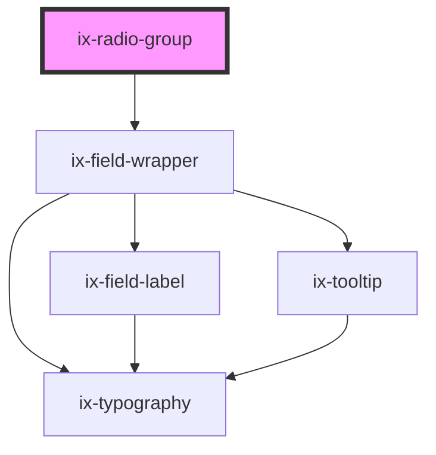

<!-- Auto Generated Below -->

## Properties

| Property            | Attribute              | Description                                                 | Type                   | Default     |
| ------------------- | ---------------------- | ----------------------------------------------------------- | ---------------------- | ----------- |
| `direction`         | `direction`            | Alignment of the radio buttons in the group                 | `"column" \| "row"`    | `'column'`  |
| `helperText`        | `helper-text`          | Show text below the field component                         | `string \| undefined`  | `undefined` |
| `infoText`          | `info-text`            | Info text for the field component                           | `string \| undefined`  | `undefined` |
| `invalidText`       | `invalid-text`         | Error text for the field component                          | `string \| undefined`  | `undefined` |
| `label`             | `label`                | Label for the field component                               | `string \| undefined`  | `undefined` |
| `showTextAsTooltip` | `show-text-as-tooltip` | Show helper, info, warning, error and valid text as tooltip | `boolean \| undefined` | `undefined` |
| `validText`         | `valid-text`           | Valid text for the field component                          | `string \| undefined`  | `undefined` |
| `value`             | `value`                | Value of the radiobutton group component                    | `string \| undefined`  | `undefined` |
| `warningText`       | `warning-text`         | Warning text for the field component                        | `string \| undefined`  | `undefined` |

## Events

| Event         | Description                                                   | Type                  |
| ------------- | ------------------------------------------------------------- | --------------------- |
| `valueChange` | Event emitted when the value of the radiobutton group changes | `CustomEvent<string>` |

## Dependencies

### Depends on

- ix-field-wrapper

### Graph

----------------------------------------------

*Built with [StencilJS](https://stenciljs.com/)*
