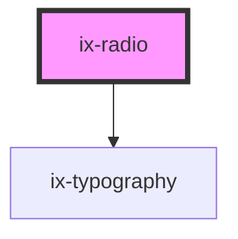

<!-- Auto Generated Below -->

## Properties

| Property   | Attribute  | Description                                                                             | Type                  | Default     |
| ---------- | ---------- | --------------------------------------------------------------------------------------- | --------------------- | ----------- |
| `checked`  | `checked`  | Checked state of the radio component                                                    | `boolean`             | `false`     |
| `disabled` | `disabled` | Disabled state of the radio component                                                   | `boolean`             | `false`     |
| `label`    | `label`    | Label for the radio component                                                           | `string \| undefined` | `undefined` |
| `name`     | `name`     | Name of the radio component                                                             | `string \| undefined` | `undefined` |
| `required` | `required` | Requires the radio component and its group to be checked for the form to be submittable | `boolean`             | `false`     |
| `value`    | `value`    | Value of the radio component                                                            | `string \| undefined` | `undefined` |

## Events

| Event           | Description                                               | Type                   |
| --------------- | --------------------------------------------------------- | ---------------------- |
| `checkedChange` | Event emitted when the checked state of the radio changes | `CustomEvent<boolean>` |
| `ixBlur`        | Event emitted when the radio is blurred                   | `CustomEvent<void>`    |
| `valueChange`   | Event emitted when the value of the radio changes         | `CustomEvent<string>`  |

## Dependencies

### Depends on

- [ix-typography](../typography)

### Graph

----------------------------------------------

*Built with [StencilJS](https://stenciljs.com/)*
