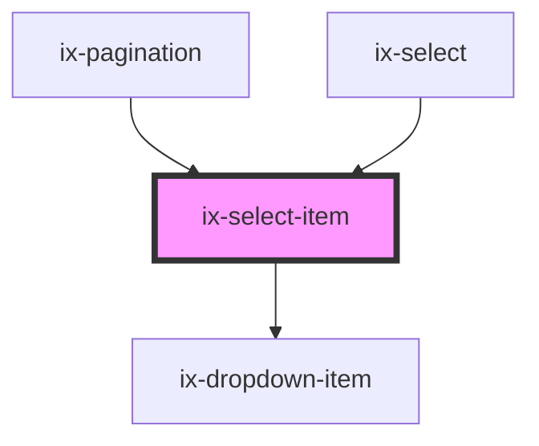

<!-- Auto Generated Below -->

## Properties

| Property             | Attribute  | Description                                                                                                                                                                                                       | Type                  | Default     |
| -------------------- | ---------- | ----------------------------------------------------------------------------------------------------------------------------------------------------------------------------------------------------------------- | --------------------- | ----------- |
| `label`              | `label`    | Displayed name of the item                                                                                                                                                                                        | `string \| undefined` | `undefined` |
| `selected`           | `selected` | Flag indicating whether the item is selected                                                                                                                                                                      | `boolean`             | `false`     |
| `value` _(required)_ | `value`    | The value of the item. Important: The select component uses string values to handle selection and will call toString() on this value. Therefor a string should be passed to value to prevent unexpected behavior. | `string`              | `undefined` |

## Events

| Event       | Description  | Type                  |
| ----------- | ------------ | --------------------- |
| `itemClick` | Item clicked | `CustomEvent<string>` |

## Dependencies

### Used by

 - [ix-pagination](../pagination)
 - [ix-select](../select)

### Depends on

- [ix-dropdown-item](../dropdown-item)

### Graph

----------------------------------------------

*Built with [StencilJS](https://stenciljs.com/)*
