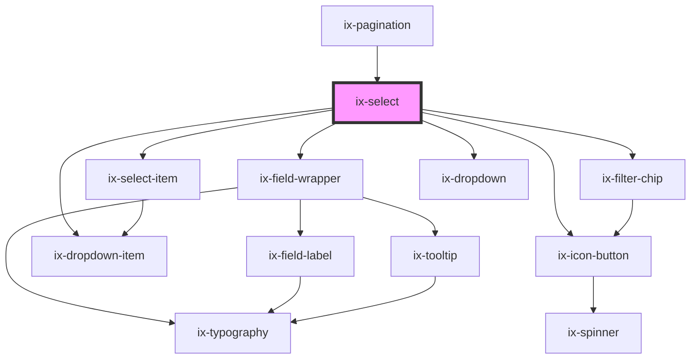

<!-- Auto Generated Below -->

## Properties

| Property                         | Attribute                             | Description                                                                                                                                                     | Type                     | Default                   |
| -------------------------------- | ------------------------------------- | --------------------------------------------------------------------------------------------------------------------------------------------------------------- | ------------------------ | ------------------------- |
| `allowClear`                     | `allow-clear`                         | Show clear button                                                                                                                                               | `boolean`                | `false`                   |
| `ariaLabelChevronDownIconButton` | `aria-label-chevron-down-icon-button` | ARIA label for the chevron down icon button Will be set as aria-label on the nested HTML button element                                                         | `string \| undefined`    | `undefined`               |
| `ariaLabelClearIconButton`       | `aria-label-clear-icon-button`        | ARIA label for the clear icon button Will be set as aria-label on the nested HTML button element                                                                | `string \| undefined`    | `undefined`               |
| `disabled`                       | `disabled`                            | If true the select will be in disabled state                                                                                                                    | `boolean`                | `false`                   |
| `dropdownMaxWidth`               | `dropdown-max-width`                  | The maximum width of the dropdown element with value and unit (e.g. "200px" or "12.5rem"). By default the maximum width of the dropdown element is set to 100%. | `string \| undefined`    | `undefined`               |
| `dropdownWidth`                  | `dropdown-width`                      | The width of the dropdown element with value and unit (e.g. "200px" or "12.5rem").                                                                              | `string \| undefined`    | `undefined`               |
| `editable`                       | `editable`                            | Select is extendable                                                                                                                                            | `boolean`                | `false`                   |
| `helperText`                     | `helper-text`                         | Helper text for the select component                                                                                                                            | `string \| undefined`    | `undefined`               |
| `hideListHeader`                 | `hide-list-header`                    | Hide list header                                                                                                                                                | `boolean`                | `false`                   |
| `i18nNoMatches`                  | `i18n-no-matches`                     | Information inside of dropdown if no items where found with current filter text                                                                                 | `string`                 | `'No matches'`            |
| `i18nPlaceholder`                | `i18n-placeholder`                    | Input field placeholder                                                                                                                                         | `string`                 | `'Select an option'`      |
| `i18nPlaceholderEditable`        | `i18n-placeholder-editable`           | Input field placeholder for editable select                                                                                                                     | `string`                 | `'Type of select option'` |
| `i18nSelectListHeader`           | `i18n-select-list-header`             | Select list header                                                                                                                                              | `string`                 | `'Select an option'`      |
| `infoText`                       | `info-text`                           | Info text for the select component                                                                                                                              | `string \| undefined`    | `undefined`               |
| `invalidText`                    | `invalid-text`                        | Error text for the select component                                                                                                                             | `string \| undefined`    | `undefined`               |
| `label`                          | `label`                               | Label for the select component                                                                                                                                  | `string \| undefined`    | `undefined`               |
| `mode`                           | `mode`                                | Selection mode                                                                                                                                                  | `"multiple" \| "single"` | `'single'`                |
| `name`                           | `name`                                | A string that represents the element's name attribute, containing a name that identifies the element when submitting the form.                                  | `string \| undefined`    | `undefined`               |
| `readonly`                       | `readonly`                            | If true the select will be in readonly mode                                                                                                                     | `boolean`                | `false`                   |
| `required`                       | `required`                            | A Boolean attribute indicating that an option with a non-empty string value must be selected                                                                    | `boolean`                | `false`                   |
| `showTextAsTooltip`              | `show-text-as-tooltip`                | Show helper, error, info, warning text as tooltip                                                                                                               | `boolean \| undefined`   | `undefined`               |
| `validText`                      | `valid-text`                          | Valid text for the select component                                                                                                                             | `string \| undefined`    | `undefined`               |
| `value`                          | `value`                               | Current selected value. This corresponds to the value property of ix-select-items                                                                               | `string \| string[]`     | `[]`                      |
| `warningText`                    | `warning-text`                        | Warning text for the select component                                                                                                                           | `string \| undefined`    | `undefined`               |

## Events

| Event         | Description                                       | Type                              |
| ------------- | ------------------------------------------------- | --------------------------------- |
| `addItem`     | Item added to selection                           | `CustomEvent<string>`             |
| `inputChange` | Event dispatched whenever the text input changes. | `CustomEvent<string>`             |
| `ixBlur`      | Blur input                                        | `CustomEvent<void>`               |
| `valueChange` | Value changed                                     | `CustomEvent<string \| string[]>` |

## Methods

### `focusInput() => Promise<void>`

Focuses the input field

#### Returns

Type: `Promise<void>`

### `getNativeInputElement() => Promise<HTMLInputElement>`

Returns the native input element used in the component.

#### Returns

Type: `Promise<HTMLInputElement>`

## Dependencies

### Used by

 - [ix-pagination](../pagination)

### Depends on

- [ix-select-item](../select-item)
- ix-field-wrapper
- [ix-filter-chip](../filter-chip)
- [ix-icon-button](../icon-button)
- [ix-dropdown](../dropdown)
- [ix-dropdown-item](../dropdown-item)

### Graph

----------------------------------------------

*Built with [StencilJS](https://stenciljs.com/)*
