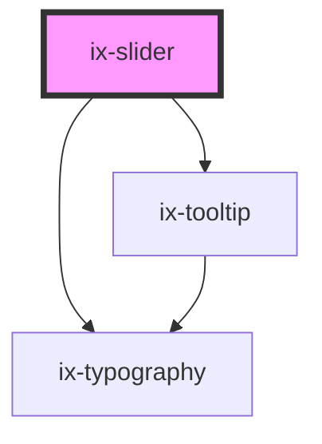

<!-- Auto Generated Below -->

## Properties

| Property         | Attribute         | Description                                                                                                | Type                             | Default     |
| ---------------- | ----------------- | ---------------------------------------------------------------------------------------------------------- | -------------------------------- | ----------- |
| `disabled`       | `disabled`        | Show control as disabled                                                                                   | `boolean`                        | `false`     |
| `error`          | `error`           | Show error state and message                                                                               | `boolean \| string \| undefined` | `undefined` |
| `marker`         | `marker`          | Define tick marker on the slider. Marker has to be within slider min/max                                   | `number[] \| undefined`          | `undefined` |
| `max`            | `max`             | Maximum slider value                                                                                       | `number`                         | `100`       |
| `min`            | `min`             | Minimum slider value                                                                                       | `number`                         | `0`         |
| `step`           | `step`            | Legal number intervals  {@link https://developer.mozilla.org/en-US/docs/Web/HTML/Element/input/range#step} | `number`                         | `1`         |
| `trace`          | `trace`           | Show a trace line                                                                                          | `boolean`                        | `false`     |
| `traceReference` | `trace-reference` | Define the start point of the trace line                                                                   | `number`                         | `0`         |
| `value`          | `value`           | Current value of the slider                                                                                | `number`                         | `0`         |

## Events

| Event         | Description | Type                  |
| ------------- | ----------- | --------------------- |
| `valueChange` |             | `CustomEvent<number>` |

## Slots

| Slot            | Description                                          |
| --------------- | ---------------------------------------------------- |
| `"label-end"`   | Element will be displayed at the end of the slider   |
| `"label-start"` | Element will be displayed at the start of the slider |

## Dependencies

### Depends on

- [ix-tooltip](../tooltip)
- [ix-typography](../typography)

### Graph

----------------------------------------------

*Built with [StencilJS](https://stenciljs.com/)*
