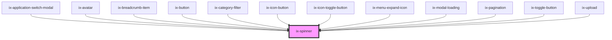

<!-- Auto Generated Below -->

## Properties

| Property  | Attribute | Description        | Type                                                        | Default       |
| --------- | --------- | ------------------ | ----------------------------------------------------------- | ------------- |
| `size`    | `size`    | Size of spinner    | `"large" \| "medium" \| "small" \| "x-small" \| "xx-small"` | `'medium'`    |
| `variant` | `variant` | Variant of spinner | `"primary" \| "secondary"`                                  | `'secondary'` |

## Dependencies

### Used by

 - ix-application-switch-modal
 - [ix-avatar](../avatar)
 - [ix-breadcrumb-item](../breadcrumb-item)
 - [ix-button](../button)
 - [ix-category-filter](../category-filter)
 - [ix-icon-button](../icon-button)
 - [ix-icon-toggle-button](../icon-toggle-button)
 - ix-menu-expand-icon
 - ix-modal-loading
 - [ix-pagination](../pagination)
 - [ix-toggle-button](../toggle-button)
 - [ix-upload](../upload)

### Graph

----------------------------------------------

*Built with [StencilJS](https://stenciljs.com/)*
