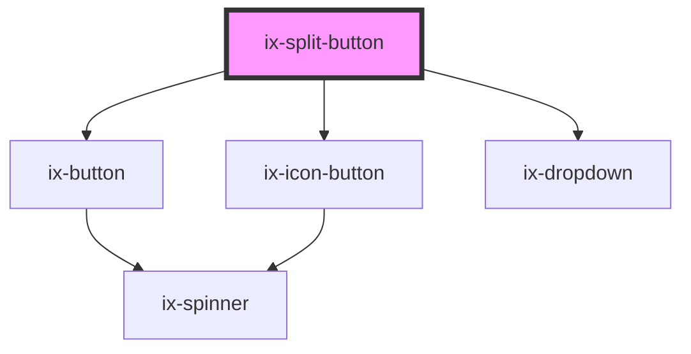

<!-- Auto Generated Below -->

## Properties

| Property                   | Attribute                      | Description                                                                                                                           | Type                                                                                                                                                                   | Default          |
| -------------------------- | ------------------------------ | ------------------------------------------------------------------------------------------------------------------------------------- | ---------------------------------------------------------------------------------------------------------------------------------------------------------------------- | ---------------- |
| `ariaLabelButton`          | `aria-label-button`            | ARIA label for the button (use if no label and icon button)                                                                           | `string \| undefined`                                                                                                                                                  | `undefined`      |
| `ariaLabelSplitIconButton` | `aria-label-split-icon-button` | ARIA label for the split icon button                                                                                                  | `string \| undefined`                                                                                                                                                  | `undefined`      |
| `closeBehavior`            | `close-behavior`               | Controls if the dropdown will be closed in response to a click event depending on the position of the event relative to the dropdown. | `"both" \| "inside" \| "outside" \| boolean`                                                                                                                           | `'both'`         |
| `disabled`                 | `disabled`                     | Disabled                                                                                                                              | `boolean`                                                                                                                                                              | `false`          |
| `icon`                     | `icon`                         | Button icon                                                                                                                           | `string \| undefined`                                                                                                                                                  | `undefined`      |
| `label`                    | `label`                        | Button label                                                                                                                          | `string \| undefined`                                                                                                                                                  | `undefined`      |
| `placement`                | `placement`                    | Placement of the dropdown                                                                                                             | `"bottom-end" \| "bottom-start" \| "left-end" \| "left-start" \| "right-end" \| "right-start" \| "top-end" \| "top-start"`                                             | `'bottom-start'` |
| `splitIcon`                | `split-icon`                   | Icon of the button on the right                                                                                                       | `string \| undefined`                                                                                                                                                  | `undefined`      |
| `variant`                  | `variant`                      | Color variant of button                                                                                                               | `"danger-primary" \| "danger-secondary" \| "danger-tertiary" \| "primary" \| "secondary" \| "subtle-primary" \| "subtle-secondary" \| "subtle-tertiary" \| "tertiary"` | `'primary'`      |

## Events

| Event         | Description    | Type                      |
| ------------- | -------------- | ------------------------- |
| `buttonClick` | Button clicked | `CustomEvent<MouseEvent>` |

## Dependencies

### Depends on

- [ix-button](../button)
- [ix-icon-button](../icon-button)
- [ix-dropdown](../dropdown)

### Graph

----------------------------------------------

*Built with [StencilJS](https://stenciljs.com/)*
