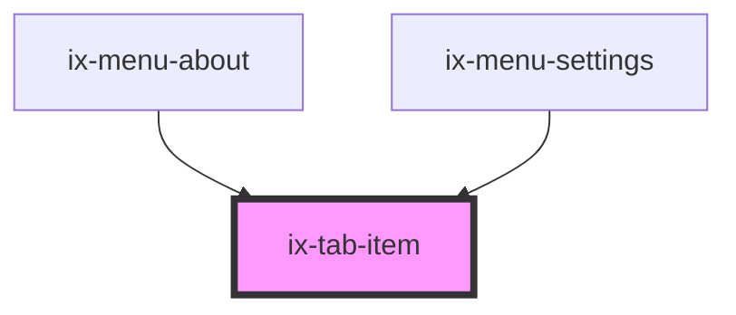

<!-- Auto Generated Below -->

## Properties

| Property    | Attribute   | Description            | Type                    | Default     |
| ----------- | ----------- | ---------------------- | ----------------------- | ----------- |
| `counter`   | `counter`   | Set counter value      | `number \| undefined`   | `undefined` |
| `disabled`  | `disabled`  | Set disabled tab       | `boolean`               | `false`     |
| `icon`      | `icon`      | Set icon only tab      | `boolean`               | `false`     |
| `layout`    | `layout`    | Set layout width style | `"auto" \| "stretched"` | `'auto'`    |
| `placement` | `placement` | Set selected placement | `"bottom" \| "top"`     | `'bottom'`  |
| `rounded`   | `rounded`   | Set rounded tab        | `boolean`               | `false`     |
| `selected`  | `selected`  | Set selected tab       | `boolean`               | `false`     |
| `small`     | `small`     | Set small size tab     | `boolean`               | `false`     |

## Events

| Event      | Description                      | Type                                        |
| ---------- | -------------------------------- | ------------------------------------------- |
| `tabClick` | Emitted when the tab is clicked. | `CustomEvent<{ nativeEvent: MouseEvent; }>` |

## Dependencies

### Used by

 - [ix-menu-about](../menu-about)
 - [ix-menu-settings](../menu-settings)

### Graph

----------------------------------------------

*Built with [StencilJS](https://stenciljs.com/)*
