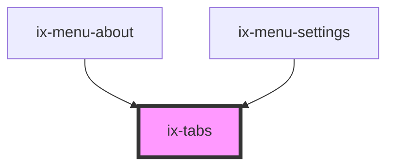

<!-- Auto Generated Below -->

## Properties

| Property                          | Attribute                              | Description                                  | Type                    | Default     |
| --------------------------------- | -------------------------------------- | -------------------------------------------- | ----------------------- | ----------- |
| `ariaLabelChevronLeftIconButton`  | `aria-label-chevron-left-icon-button`  | ARIA label for the chevron left icon button  | `string \| undefined`   | `undefined` |
| `ariaLabelChevronRightIconButton` | `aria-label-chevron-right-icon-button` | ARIA label for the chevron right icon button | `string \| undefined`   | `undefined` |
| `layout`                          | `layout`                               | Set layout width style                       | `"auto" \| "stretched"` | `'auto'`    |
| `placement`                       | `placement`                            | Set placement style                          | `"bottom" \| "top"`     | `'bottom'`  |
| `rounded`                         | `rounded`                              | Set rounded tabs                             | `boolean`               | `false`     |
| `selected`                        | `selected`                             | Set default selected tab by index            | `number`                | `0`         |
| `small`                           | `small`                                | Set tab items to small size                  | `boolean`               | `false`     |

## Events

| Event            | Description                 | Type                  |
| ---------------- | --------------------------- | --------------------- |
| `selectedChange` | `selected` property changed | `CustomEvent<number>` |

## Dependencies

### Used by

 - [ix-menu-about](../menu-about)
 - [ix-menu-settings](../menu-settings)

### Graph

----------------------------------------------

*Built with [StencilJS](https://stenciljs.com/)*
