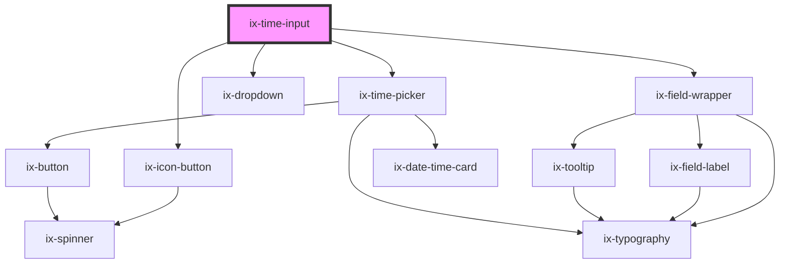

<!-- Auto Generated Below -->

## Properties

| Property                      | Attribute                        | Description                                                                                                                | Type                   | Default               |
| ----------------------------- | -------------------------------- | -------------------------------------------------------------------------------------------------------------------------- | ---------------------- | --------------------- |
| `disabled`                    | `disabled`                       | Disabled attribute                                                                                                         | `boolean`              | `false`               |
| `format`                      | `format`                         | Format of time string See {@link https://moment.github.io/luxon/#/formatting?id=table-of-tokens} for all available tokens. | `string`               | `'TT'`                |
| `helperText`                  | `helper-text`                    | Helper text below the input field                                                                                          | `string \| undefined`  | `undefined`           |
| `hideHeader`                  | `hide-header`                    | Hides the header of the picker.                                                                                            | `boolean`              | `false`               |
| `hourInterval`                | `hour-interval`                  | Interval for hour selection                                                                                                | `number`               | `1`                   |
| `i18nErrorTimeUnparsable`     | `i18n-error-time-unparsable`     | I18n string for the error message when the time is not parsable                                                            | `string`               | `'Time is not valid'` |
| `i18nHourColumnHeader`        | `i18n-hour-column-header`        | Text for time-picker hour column header                                                                                    | `string`               | `'hr'`                |
| `i18nMillisecondColumnHeader` | `i18n-millisecond-column-header` | Text for time-picker millisecond column header                                                                             | `string`               | `'ms'`                |
| `i18nMinuteColumnHeader`      | `i18n-minute-column-header`      | Text for time-picker minute column header                                                                                  | `string`               | `'min'`               |
| `i18nSecondColumnHeader`      | `i18n-second-column-header`      | Text for time-picker second column header                                                                                  | `string`               | `'sec'`               |
| `i18nSelectTime`              | `i18n-select-time`               | Text of time-picker time select button                                                                                     | `string`               | `'Confirm'`           |
| `i18nTime`                    | `i18n-time`                      | Text for time-picker top label                                                                                             | `string`               | `'Time'`              |
| `infoText`                    | `info-text`                      | Info text below the input field                                                                                            | `string \| undefined`  | `undefined`           |
| `invalidText`                 | `invalid-text`                   | Error text below the input field                                                                                           | `string \| undefined`  | `undefined`           |
| `label`                       | `label`                          | Label of the input field                                                                                                   | `string \| undefined`  | `undefined`           |
| `millisecondInterval`         | `millisecond-interval`           | Interval for millisecond selection                                                                                         | `number`               | `100`                 |
| `minuteInterval`              | `minute-interval`                | Interval for minute selection                                                                                              | `number`               | `1`                   |
| `name`                        | `name`                           | Name of the input element                                                                                                  | `string \| undefined`  | `undefined`           |
| `placeholder`                 | `placeholder`                    | Placeholder of the input element                                                                                           | `string \| undefined`  | `undefined`           |
| `readonly`                    | `readonly`                       | Readonly attribute                                                                                                         | `boolean`              | `false`               |
| `required`                    | `required`                       | Required attribute                                                                                                         | `boolean \| undefined` | `undefined`           |
| `secondInterval`              | `second-interval`                | Interval for second selection                                                                                              | `number`               | `1`                   |
| `showTextAsTooltip`           | `show-text-as-tooltip`           | Show text as tooltip                                                                                                       | `boolean \| undefined` | `undefined`           |
| `validText`                   | `valid-text`                     | Valid text below the input field                                                                                           | `string \| undefined`  | `undefined`           |
| `value`                       | `value`                          | Value of the input element                                                                                                 | `string`               | `''`                  |
| `warningText`                 | `warning-text`                   | Warning text below the input field                                                                                         | `string \| undefined`  | `undefined`           |

## Events

| Event                 | Description                    | Type                                                                              |
| --------------------- | ------------------------------ | --------------------------------------------------------------------------------- |
| `validityStateChange` | Validation state change event. | `CustomEvent<{ patternMismatch: boolean; invalidReason?: string \| undefined; }>` |
| `valueChange`         | Input change event.            | `CustomEvent<string>`                                                             |

## Methods

### `focusInput() => Promise<void>`

Focuses the input field

#### Returns

Type: `Promise<void>`

### `getNativeInputElement() => Promise<HTMLInputElement>`

Get the native input element

#### Returns

Type: `Promise<HTMLInputElement>`

## Slots

| Slot      | Description                                         |
| --------- | --------------------------------------------------- |
| `"end"`   | Element will be displayed at the end of the input   |
| `"start"` | Element will be displayed at the start of the input |

## Dependencies

### Depends on

- [ix-icon-button](../icon-button)
- ix-field-wrapper
- [ix-dropdown](../dropdown)
- [ix-time-picker](../time-picker)

### Graph

----------------------------------------------

*Built with [StencilJS](https://stenciljs.com/)*
