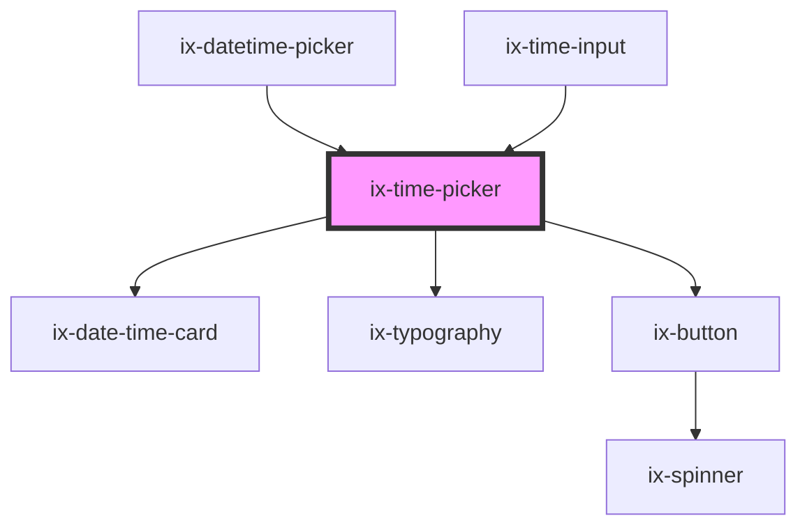

<!-- Auto Generated Below -->

## Properties

| Property                      | Attribute                        | Description                                                                                                                                                                                                                                             | Type                                           | Default                                |
| ----------------------------- | -------------------------------- | ------------------------------------------------------------------------------------------------------------------------------------------------------------------------------------------------------------------------------------------------------- | ---------------------------------------------- | -------------------------------------- |
| `corners`                     | `corners`                        | Corner style                                                                                                                                                                                                                                            | `"left" \| "right" \| "rounded" \| "straight"` | `'rounded'`                            |
| `embedded`                    | `embedded`                       | Embedded style (for use in other components)                                                                                                                                                                                                            | `boolean`                                      | `false`                                |
| `format`                      | `format`                         | Format of time string See {@link https://moment.github.io/luxon/#/formatting?id=table-of-tokens} for all available tokens. Note: Formats that combine date and time (like f or F) are not supported. Timestamp tokens x and X are not supported either. | `string`                                       | `'TT'`                                 |
| `hideHeader`                  | `hide-header`                    | Hides the header of the picker.                                                                                                                                                                                                                         | `boolean`                                      | `false`                                |
| `hourInterval`                | `hour-interval`                  | Interval for hour selection                                                                                                                                                                                                                             | `number`                                       | `HOUR_INTERVAL_DEFAULT`                |
| `i18nConfirmTime`             | `i18n-confirm-time`              | Text of the time confirm button                                                                                                                                                                                                                         | `string`                                       | `CONFIRM_BUTTON_DEFAULT`               |
| `i18nHeader`                  | `i18n-header`                    | Text for top header                                                                                                                                                                                                                                     | `string`                                       | `HEADER_DEFAULT`                       |
| `i18nHourColumnHeader`        | `i18n-column-header`             | Text for hour column header                                                                                                                                                                                                                             | `string`                                       | `'hr'`                                 |
| `i18nMillisecondColumnHeader` | `i18n-millisecond-column-header` | Text for millisecond column header                                                                                                                                                                                                                      | `string`                                       | `'ms'`                                 |
| `i18nMinuteColumnHeader`      | `i18n-minute-column-header`      | Text for minute column header                                                                                                                                                                                                                           | `string`                                       | `'min'`                                |
| `i18nSecondColumnHeader`      | `i18n-second-column-header`      | Text for second column header                                                                                                                                                                                                                           | `string`                                       | `'sec'`                                |
| `millisecondInterval`         | `millisecond-interval`           | Interval for millisecond selection                                                                                                                                                                                                                      | `number`                                       | `MILLISECOND_INTERVAL_DEFAULT`         |
| `minuteInterval`              | `minute-interval`                | Interval for minute selection                                                                                                                                                                                                                           | `number`                                       | `MINUTE_INTERVAL_DEFAULT`              |
| `secondInterval`              | `second-interval`                | Interval for second selection                                                                                                                                                                                                                           | `number`                                       | `SECOND_INTERVAL_DEFAULT`              |
| `time`                        | `time`                           | Select time with format string Format has to match the `format` property.                                                                                                                                                                               | `string`                                       | `DateTime.now().toFormat(this.format)` |

## Events

| Event        | Description       | Type                  |
| ------------ | ----------------- | --------------------- |
| `timeChange` | Time change event | `CustomEvent<string>` |
| `timeSelect` | Time event        | `CustomEvent<string>` |

## Methods

### `getCurrentTime() => Promise<string | undefined>`

Get the current time based on the wanted format

#### Returns

Type: `Promise<string | undefined>`

## Dependencies

### Used by

 - [ix-datetime-picker](../datetime-picker)
 - [ix-time-input](../time-input)

### Depends on

- ix-date-time-card
- [ix-typography](../typography)
- [ix-button](../button)

### Graph

----------------------------------------------

*Built with [StencilJS](https://stenciljs.com/)*
