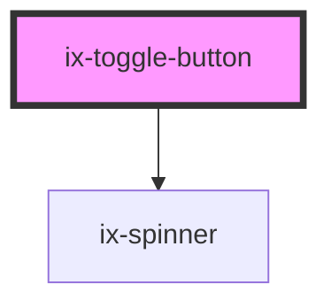

<!-- Auto Generated Below -->

## Properties

| Property          | Attribute           | Description                                                                           | Type                                                                                                    | Default            |
| ----------------- | ------------------- | ------------------------------------------------------------------------------------- | ------------------------------------------------------------------------------------------------------- | ------------------ |
| `ariaLabelButton` | `aria-label-button` | ARIA label for the button Will be set as aria-label on the nested HTML button element | `string \| undefined`                                                                                   | `undefined`        |
| `disabled`        | `disabled`          | Disable the button                                                                    | `boolean`                                                                                               | `false`            |
| `icon`            | `icon`              | Icon name                                                                             | `string \| undefined`                                                                                   | `undefined`        |
| `iconRight`       | `icon-right`        | Icon name for the right side of the button                                            | `string \| undefined`                                                                                   | `undefined`        |
| `loading`         | `loading`           | Loading button                                                                        | `boolean`                                                                                               | `false`            |
| `pressed`         | `pressed`           | Show button as pressed                                                                | `boolean`                                                                                               | `false`            |
| `variant`         | `variant`           | Button variant.                                                                       | `"primary" \| "secondary" \| "subtle-primary" \| "subtle-secondary" \| "subtle-tertiary" \| "tertiary"` | `'subtle-primary'` |

## Events

| Event           | Description          | Type                   |
| --------------- | -------------------- | ---------------------- |
| `pressedChange` | Pressed change event | `CustomEvent<boolean>` |

## Dependencies

### Depends on

- [ix-spinner](../spinner)

### Graph

----------------------------------------------

*Built with [StencilJS](https://stenciljs.com/)*
