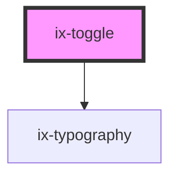

<!-- Auto Generated Below -->

## Properties

| Property            | Attribute            | Description                                                                                  | Type                  | Default     |
| ------------------- | -------------------- | -------------------------------------------------------------------------------------------- | --------------------- | ----------- |
| `checked`           | `checked`            | Whether the slide-toggle element is checked or not.                                          | `boolean`             | `false`     |
| `disabled`          | `disabled`           | Whether the slide-toggle element is disabled or not.                                         | `boolean`             | `false`     |
| `hideText`          | `hide-text`          | Hide `on` and `off` text                                                                     | `boolean`             | `false`     |
| `indeterminate`     | `indeterminate`      | If true the control is in indeterminate state                                                | `boolean`             | `false`     |
| `name`              | `name`               | Name of the checkbox component                                                               | `string \| undefined` | `undefined` |
| `required`          | `required`           | Required state of the checkbox component.  If true, checkbox needs to be checked to be valid | `boolean`             | `false`     |
| `textIndeterminate` | `text-indeterminate` | Text for indeterminate state                                                                 | `string`              | `'Mixed'`   |
| `textOff`           | `text-off`           | Text for off state                                                                           | `string`              | `'Off'`     |
| `textOn`            | `text-on`            | Text for on state                                                                            | `string`              | `'On'`      |
| `value`             | `value`              | Value of the checkbox component                                                              | `string`              | `'on'`      |

## Events

| Event           | Description                                                               | Type                   |
| --------------- | ------------------------------------------------------------------------- | ---------------------- |
| `checkedChange` | An event will be dispatched each time the slide-toggle changes its value. | `CustomEvent<boolean>` |
| `ixBlur`        | An event will be dispatched each time the toggle is blurred.              | `CustomEvent<void>`    |

## Dependencies

### Depends on

- [ix-typography](../typography)

### Graph

----------------------------------------------

*Built with [StencilJS](https://stenciljs.com/)*
