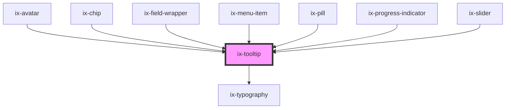

<!-- Auto Generated Below -->

## Properties

| Property       | Attribute       | Description                                                                                                                                  | Type                                                                               | Default     |
| -------------- | --------------- | -------------------------------------------------------------------------------------------------------------------------------------------- | ---------------------------------------------------------------------------------- | ----------- |
| `for`          | `for`           | CSS selector for hover trigger element e.g. `for="[data-my-custom-select]"`                                                                  | `ElementReference[] \| HTMLElement \| Promise<HTMLElement> \| string \| undefined` | `undefined` |
| `interactive`  | `interactive`   | Define if the user can access the tooltip via mouse.                                                                                         | `boolean`                                                                          | `false`     |
| `placement`    | `placement`     | Initial placement of the tooltip. If the selected placement doesn't have enough space, the tooltip will be repositioned to another location. | `"bottom" \| "left" \| "right" \| "top"`                                           | `'top'`     |
| `titleContent` | `title-content` | Title of the tooltip                                                                                                                         | `string \| undefined`                                                              | `undefined` |

## Slots

| Slot              | Description              |
| ----------------- | ------------------------ |
| `"title-content"` | Content of tooltip title |
| `"title-icon"`    | Icon of tooltip title    |

## Dependencies

### Used by

 - [ix-avatar](../avatar)
 - [ix-chip](../chip)
 - ix-field-wrapper
 - [ix-menu-item](../menu-item)
 - [ix-pill](../pill)
 - [ix-progress-indicator](../progress-indicator)
 - [ix-slider](../slider)

### Depends on

- [ix-typography](../typography)

### Graph

----------------------------------------------

*Built with [StencilJS](https://stenciljs.com/)*
