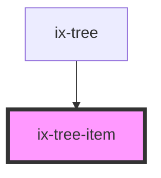

<!-- Auto Generated Below -->

## Properties

| Property               | Attribute                 | Description                     | Type                           | Default     |
| ---------------------- | ------------------------- | ------------------------------- | ------------------------------ | ----------- |
| `ariaLabelChevronIcon` | `aria-label-chevron-icon` | ARIA label for the chevron icon | `string \| undefined`          | `undefined` |
| `context`              | `context`                 | Context                         | `TreeItemContext \| undefined` | `undefined` |
| `hasChildren`          | `has-children`            | Has tree item children          | `boolean`                      | `false`     |
| `text`                 | `text`                    | Text                            | `string \| undefined`          | `undefined` |

## Events

| Event       | Description                                   | Type                |
| ----------- | --------------------------------------------- | ------------------- |
| `itemClick` | Click on item not on the expand/collapse icon | `CustomEvent<void>` |
| `toggle`    | Expand/Collapsed toggled                      | `CustomEvent<void>` |

## Dependencies

### Used by

 - [ix-tree](../tree)

### Graph

----------------------------------------------

*Built with [StencilJS](https://stenciljs.com/)*
