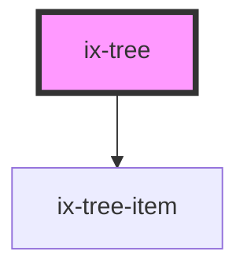

<!-- Auto Generated Below -->

## Properties

| Property            | Attribute              | Description                                 | Type                                                                                                                                               | Default     |
| ------------------- | ---------------------- | ------------------------------------------- | -------------------------------------------------------------------------------------------------------------------------------------------------- | ----------- |
| `context`           | `context`              | Selection and collapsed state management    | `{ [x: string]: TreeItemContext; }`                                                                                                                | `{}`        |
| `model`             | `model`                | Tree model                                  | `{ [x: string]: TreeItem<any>; }`                                                                                                                  | `{}`        |
| `renderItem`        | `render-item`          | Render function of tree items               | `(<T = any>(index: number, data: T, dataList: T[], context: TreeContext, update: (callback: UpdateCallback) => void) => HTMLElement) \| undefined` | `undefined` |
| `root`              | `root`                 | Initial root element will not be rendered   | `string`                                                                                                                                           | `'root'`    |
| `toggleOnItemClick` | `toggle-on-item-click` | Enable to toggle items by click on the item | `boolean \| undefined`                                                                                                                             | `undefined` |

## Events

| Event           | Description         | Type                                                |
| --------------- | ------------------- | --------------------------------------------------- |
| `contextChange` | Context changed     | `CustomEvent<{ [x: string]: TreeItemContext; }>`    |
| `nodeClicked`   | Node clicked event  | `CustomEvent<string>`                               |
| `nodeRemoved`   | Emits removed nodes | `CustomEvent<any>`                                  |
| `nodeToggled`   | Node toggled event  | `CustomEvent<{ id: string; isExpanded: boolean; }>` |

## Methods

### `markItemsAsDirty(ids: string[]) => Promise<void>`

Mark items as dirty.
This will force the list to re-render the items with the given ids.

#### Parameters

| Name  | Type       | Description |
| ----- | ---------- | ----------- |
| `ids` | `string[]` |             |

#### Returns

Type: `Promise<void>`

### `refreshTree(options?: RefreshTreeOptions) => Promise<void>`

Refresh the list.
This will re-render the list with the current model and context.

#### Parameters

| Name      | Type                                | Description |
| --------- | ----------------------------------- | ----------- |
| `options` | `{ force?: boolean \| undefined; }` |             |

#### Returns

Type: `Promise<void>`

## Dependencies

### Depends on

- [ix-tree-item](../tree-item)

### Graph

----------------------------------------------

*Built with [StencilJS](https://stenciljs.com/)*
