<!-- Auto Generated Below -->

## Properties

| Property         | Attribute         | Description                         | Type                                                                                                                                                                                                                                                                               | Default     |
| ---------------- | ----------------- | ----------------------------------- | ---------------------------------------------------------------------------------------------------------------------------------------------------------------------------------------------------------------------------------------------------------------------------------- | ----------- |
| `bold`           | `bold`            | Display text bold                   | `boolean`                                                                                                                                                                                                                                                                          | `false`     |
| `format`         | `format`          | Text format                         | `TypographyFormat \| undefined`                                                                                                                                                                                                                                                    | `undefined` |
| `textColor`      | `text-color`      | Text color based on theme variables | `"alarm" \| "alarm-contrast" \| "contrast" \| "critical-contrast" \| "info-contrast" \| "inv-contrast" \| "inv-soft" \| "inv-std" \| "inv-weak" \| "neutral-contrast" \| "primary-contrast" \| "soft" \| "std" \| "success-contrast" \| "warning-contrast" \| "weak" \| undefined` | `undefined` |
| `textDecoration` | `text-decoration` | Text decoration                     | `"line-through" \| "none" \| "underline"`                                                                                                                                                                                                                                          | `'none'`    |

## Dependencies

### Used by

 - [ix-action-card](../action-card)
 - [ix-application-header](../application-header)
 - ix-application-switch-modal
 - [ix-avatar](../avatar)
 - [ix-blind](../blind)
 - [ix-card-list](../card-list)
 - [ix-checkbox](../checkbox)
 - [ix-content-header](../content-header)
 - [ix-dropdown-header](../dropdown-header)
 - [ix-empty-state](../empty-state)
 - [ix-field-label](../field-label)
 - ix-field-wrapper
 - [ix-helper-text](../helper-text)
 - [ix-input](../input)
 - [ix-menu-about-news](../menu-about-news)
 - [ix-menu-category](../menu-category)
 - [ix-modal-header](../modal-header)
 - [ix-pagination](../pagination)
 - [ix-pane](../pane)
 - [ix-progress-indicator](../progress-indicator)
 - [ix-push-card](../push-card)
 - [ix-radio](../radio)
 - [ix-slider](../slider)
 - [ix-textarea](../input)
 - [ix-time-picker](../time-picker)
 - [ix-toast](../toast)
 - [ix-toggle](../toggle)
 - [ix-tooltip](../tooltip)

### Graph

```mermaid
graph TD;
  ix-action-card --> ix-typography
  ix-application-header --> ix-typography
  ix-application-switch-modal --> ix-typography
  ix-avatar --> ix-typography
  ix-blind --> ix-typography
  ix-card-list --> ix-typography
  ix-checkbox --> ix-typography
  ix-content-header --> ix-typography
  ix-dropdown-header --> ix-typography
  ix-empty-state --> ix-typography
  ix-field-label --> ix-typography
  ix-field-wrapper --> ix-typography
  ix-helper-text --> ix-typography
  ix-input --> ix-typography
  ix-menu-about-news --> ix-typography
  ix-menu-category --> ix-typography
  ix-modal-header --> ix-typography
  ix-pagination --> ix-typography
  ix-pane --> ix-typography
  ix-progress-indicator --> ix-typography
  ix-push-card --> ix-typography
  ix-radio --> ix-typography
  ix-slider --> ix-typography
  ix-textarea --> ix-typography
  ix-time-picker --> ix-typography
  ix-toast --> ix-typography
  ix-toggle --> ix-typography
  ix-tooltip --> ix-typography
  style ix-typography fill:#f9f,stroke:#333,stroke-width:4px
```

----------------------------------------------

*Built with [StencilJS](https://stenciljs.com/)*
