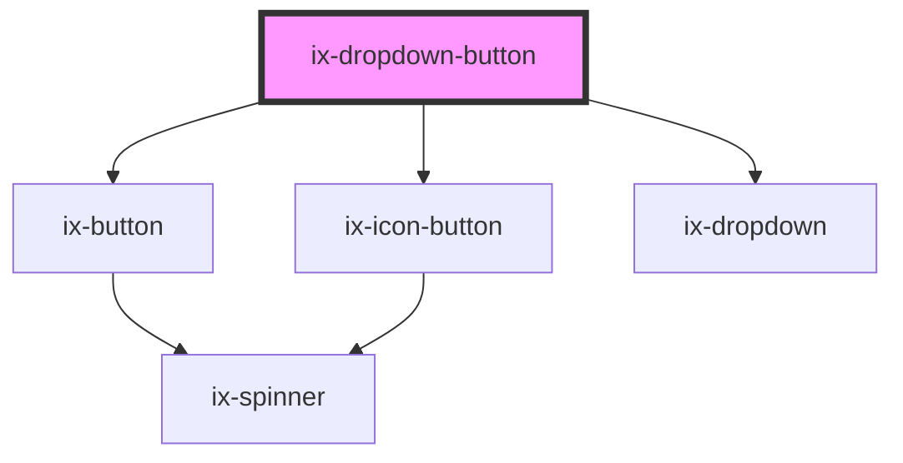

# ix-dropdown-button

<!-- Auto Generated Below -->

## Properties

| Property                  | Attribute                    | Description                                                                                                                           | Type                                                                                                                                                                   | Default     |
| ------------------------- | ---------------------------- | ------------------------------------------------------------------------------------------------------------------------------------- | ---------------------------------------------------------------------------------------------------------------------------------------------------------------------- | ----------- |
| `ariaLabelDropdownButton` | `aria-label-dropdown-button` | ARIA label for the dropdown button Will be set as aria-label on the nested HTML button element                                        | `string \| undefined`                                                                                                                                                  | `undefined` |
| `closeBehavior`           | `close-behavior`             | Controls if the dropdown will be closed in response to a click event depending on the position of the event relative to the dropdown. | `"both" \| "inside" \| "outside" \| boolean`                                                                                                                           | `'both'`    |
| `disabled`                | `disabled`                   | Disable button                                                                                                                        | `boolean`                                                                                                                                                              | `false`     |
| `icon`                    | `icon`                       | Button icon                                                                                                                           | `string \| undefined`                                                                                                                                                  | `undefined` |
| `label`                   | `label`                      | Set label                                                                                                                             | `string \| undefined`                                                                                                                                                  | `undefined` |
| `placement`               | `placement`                  | Placement of the dropdown                                                                                                             | `"bottom-end" \| "bottom-start" \| "left-end" \| "left-start" \| "right-end" \| "right-start" \| "top-end" \| "top-start" \| undefined`                                | `undefined` |
| `variant`                 | `variant`                    | Button variant                                                                                                                        | `"danger-primary" \| "danger-secondary" \| "danger-tertiary" \| "primary" \| "secondary" \| "subtle-primary" \| "subtle-secondary" \| "subtle-tertiary" \| "tertiary"` | `'primary'` |

## Dependencies

### Depends on

- [ix-button](../button)
- [ix-icon-button](../icon-button)
- [ix-dropdown](../dropdown)

### Graph

----------------------------------------------

*Built with [StencilJS](https://stenciljs.com/)*
