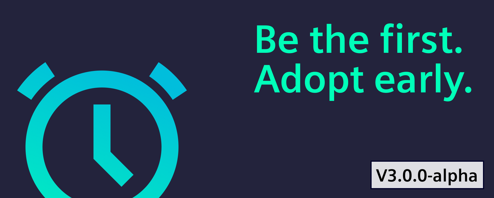
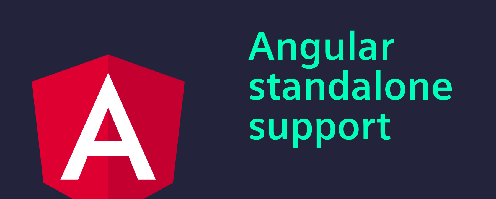
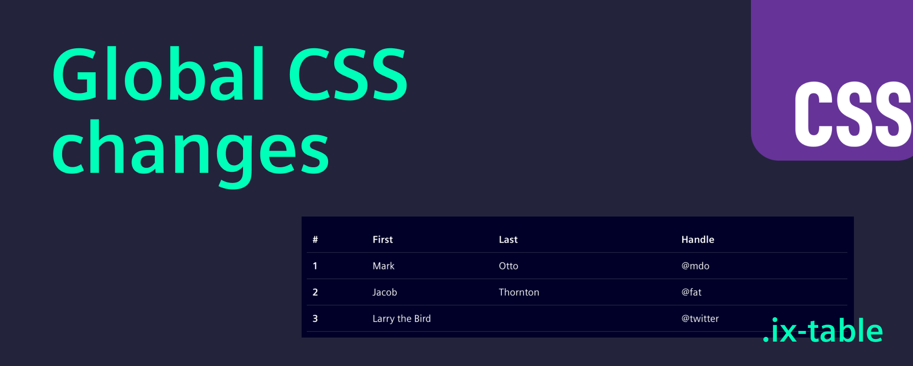
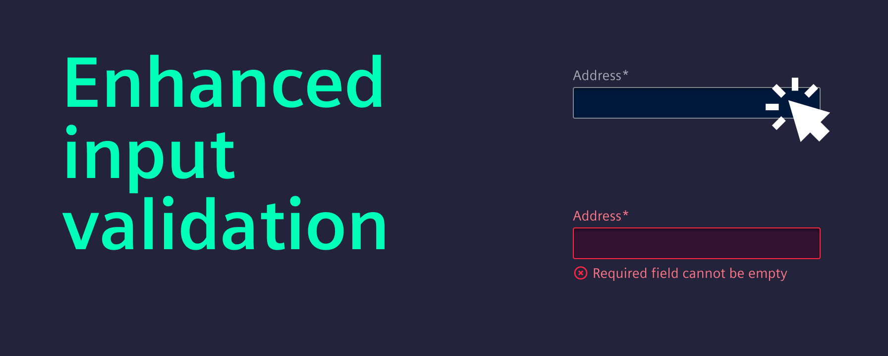
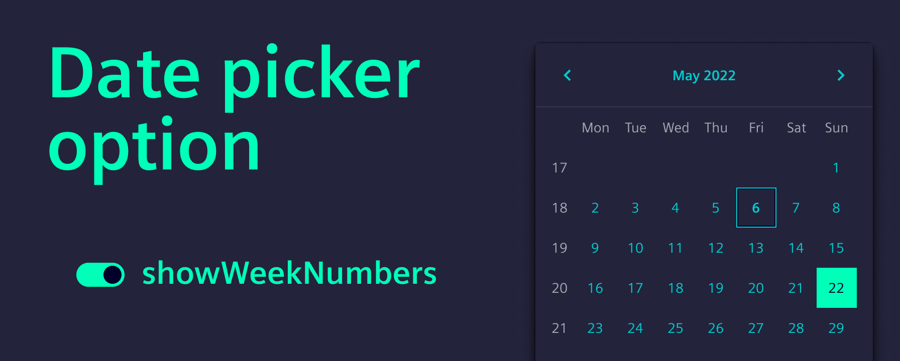

# Release 3.0.0 alpha



Are you ready to be among the first to experience 3.0.0?

We are seeking early adopters to test our alpha release and provide valuable feedback.

As we prepare for the official launch of Industrial Experience 3.0.0, your insights will help us refine the code, documentation, and migration guide.

Your participation not only benefits us but also the entire community eagerly awaiting this major update.

<!-- truncate -->

# How to start?

- Install `@siemens/ix` (`@siemens/ix-angular`, `@siemens/ix-react`, `@siemens/ix-vue`) via the `alpha` tag
- Get an exclusive preview of our revamped documentation [here](https://ix.siemens.io/version-alpha/)

Access the comprehensive migration guide to smoothly transition to the new version [here](https://ix.siemens.io/version-alpha/docs/home/migration/3_0_0/)

Your feedback on the new version, documentation redesign, and change log is crucial.

# Update Angular version and support standalone components



**Exciting updates** have been made to our Angular support, enhancing compatibility and ease of use for developers.

**Key changes:**

- **Minimum Angular version:** The minimum supported Angular version has been updated to version 18.
- **Support standalone components:** We now support Angular standalone components out of the box.

**Example:**

```typescript
import { Component } from '@angular/core';
import { IxButton } from '@siemens/ix-angular/standalone';

@Component({
  standalone: true,
  selector: 'app-example',
  imports: [IxButton],
  template: `
    <ix-button>Button</ix-button>
    <ix-button disabled>Button</ix-button>
  `,
})
export default class Buttons {}
```

Standalone components offer a more straightforward approach to developing Angular applications. By utilizing standalone components, directives, and pipes, developers can enhance the authoring experience and minimize reliance on NgModules.

# Global CSS Changes



To avoid style collisions with other CSS frameworks or libraries, a prefix has been added to some global styles such as table, input, and label.

**Key changes**:

- **Input and textarea**: Global styling has been prevented. To use legacy styling, add `class="ix-form-control"` to input or textarea.
- **Label**: Global styling has been prevented. To use legacy styling, add `class="ix-form-label"` to label.
- **Table**: New global classes `.ix-table` and `.ix-table-striped` have been added to display a simple HTML table. These changes aim to enhance compatibility and prevent conflicts in styling across different frameworks and libraries.

# Bootstrap is removed from our dependencies


The CSS framework Bootstrap has been removed from our main style file, marking a significant change in our approach to styling.

**Key changes:**

- **Bootstrap removal:** The third-party CSS framework Bootstrap has been completely removed from our style file.

**Why this is beneficial:**

- **Reduced dependency:** Removing Bootstrap reduces dependency on third-party frameworks, leading to fewer compatibility issues and conflicts with other libraries.
- **Improved performance:** Without the additional overhead of Bootstrap, the overall performance and loading times of our applications can improve.
- **Customization and control:** This change allows for greater customization and control over the styling, enabling more tailored and specific design choices that align with our unique requirements.

# Input validation enhancements



Input elements have been updated to improve user experience by preventing required validation errors from appearing without any user interaction.

**Key changes:**

- **Input elements affected:** ix-input, ix-number-input, ix-date-input, ix-select, and ix-textarea will no longer show required validation errors unless there has been user interaction.
- **Programmatic validation:** If the class ix-invalid is applied programmatically, an error message will still be shown even without user interaction.

# Date picker enhancements



Week numbers are now hidden by default in several date-related components, enhancing the user interface and simplifying the display.

**Key changes:**

**ix-date-picker**: Week numbers are hidden by default. To show them, set `showWeekNumbers` to true.
**ix-datetime-picker**: Week numbers are hidden by default. To show them, set `showWeekNumbers` to true.
**ix-date-dropdown**: Week numbers are hidden by default. To show them, set `showWeekNumbers` to true.
**ix-date-input**: Week numbers are hidden by default. To show them, set `showWeekNumbers` to true.

Please reach out to us at [team.ix.industry@siemens.com](mailto:team.ix.industry@siemens.com) and tell us about your migration experience.
If you encounter any issues, we are here to support you every step of the way.

🙏 We greatly appreciate your contributions.
