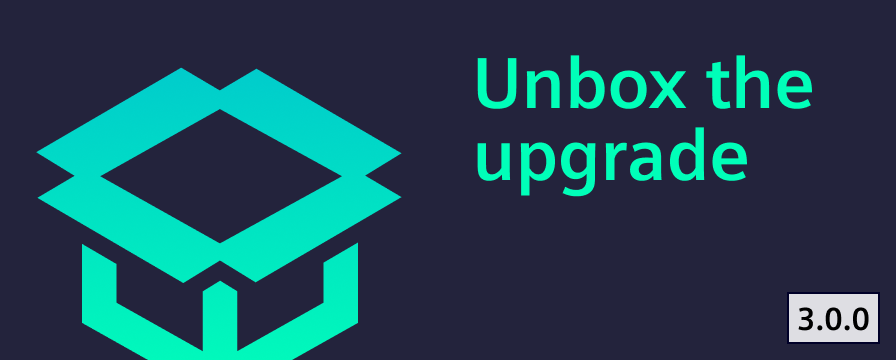

# Release V3.0.0

After gathering feedback on our alpha release, we proudly present the official launch of Industrial Experience V3.0.0.

<!-- truncate -->

# How to start?

- Install `@siemens/ix` (`@siemens/ix-angular`, `@siemens/ix-react`, `@siemens/ix-vue`) via the `alpha` tag
- Access the comprehensive migration guide to smoothly transition to the new version [here](../../docs/home/migration/3_0_0).

# What's new?

Our previous [blog entry on the alpha release](./../2025-04-03-alpha-release-3/index.md) provides a detailed description of the new features. Here is a brief summary:

- **Improved Angular support:** Enhancing compatibility and ease of use for developers by updaging the minimum supported Angular version to version 18 and supporting Angular standalone components out of the box.
- **Global CSS Changes:** To avoid style collisions with other CSS frameworks or libraries, a prefix has been added to some global styles such as table, input, and label.
- **Bootstrap removal:** The CSS framework Bootstrap has been removed from our main style file, marking a significant change in our approach to styling.
- **Input validation enhancements:** Input elements have been updated to improve user experience by preventing required validation errors from appearing without any user interaction.
- **Date picker enhancements:** Week numbers are now hidden by default in several date-related components, enhancing the user interface and simplifying the display.
- **Documentation redesign:** Introducing horizontal navigation in the header for quick access to essential resources and improved usability for component pages with a new preview and code snippet and an aligned property table.
- **Versioning of documentation:** Users can now switch between different versions, making it easier to reference older documentation and track changes over time.

Please reach out to us at [team.ix.industry@siemens.com](mailto:team.ix.industry@siemens.com) and tell us about your migration experience.
If you encounter any issues, we are here to support you every step of the way.

🙏 We greatly appreciate your contributions.
