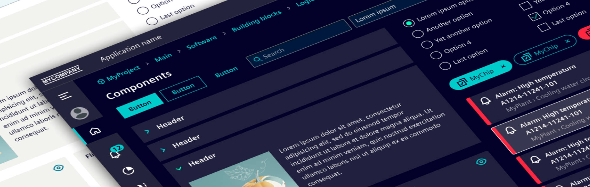

import {Card, CardList} from '@site/src/components/Card';
import DesignKit from '@site/src/components/design-kit/DesignKit';
import Separator from '@site/src/components/separator/Separator';

# Design resources

## Figma Siemens brand library

The Siemens brand library contains Siemens specific brand elements and is only accessible to Siemens employees and business partners.

› [Get more information here](https://siemens-ix.code.siemens.io/ix-brand-theme/)

We use Figma variables to provide you a seamless and customizable experience when working with our themes. For detailed instructions on how to modify theme variables and select themes using the Figma library, please visit the [Theme Switching](../guidelines/theme-switching.md) page.

## Figma classic theme library (Open Source)
Will be available soon.

## Sketch libraries (discontinued)
As we have focused on the design tool Figma, we don’t maintain the Sketch library anymore. Nevertheless, you can still download these libraries.

### Sketch Siemens brand library (discontinued)

› [Download here](https://siemens-ix.code.siemens.io/ix-brand-theme/sketch.zip)

### Sketch open-source library (discontinued)

› [Download here](/files/sketch.zip)
