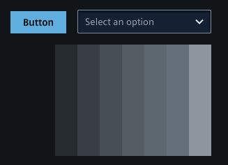
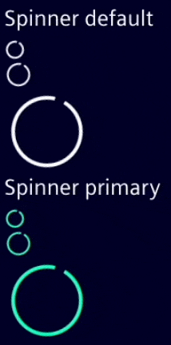
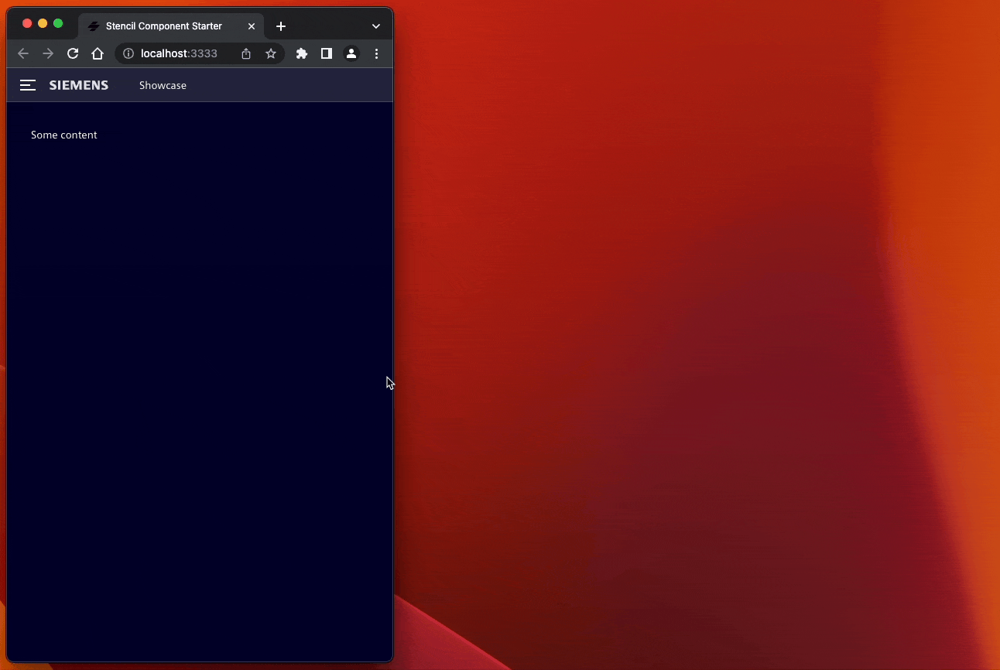

## Breaking changes in v2.0.0

You can find a list of all breaking changes [here](https://github.com/siemens/ix/blob/main/BREAKING_CHANGES.md#v200).
The most important breaking changes result from the switch to an SVG based implementation for icons:

### Removed icon font @siemens/ix-icons

The internal implementation of `@siemens/ix-icons` changed from icon font to a `SVG` based implementation.
This shouldn't have any direct impact on your application.

### Custom icon support for @siemens/ix, @siemens/ix-react, @siemens/ix-angular and @siemens/ix-vue

You can now provide custom icons as inline SVG or via relative/absolute path to the asset.

Example of a custom icon via path:

```tsx
  <ix-icon name="./assets/my-icon.svg"></ix-icon>
  <ix-icon name="https://my.example.cdn.address/assets/my-icon.svg"></ix-icon>
```

There are some constraints for using custom icons. For more information please refer to the guide in the documentation [here](/docs/icons/icon-library).

### Move @siemens/ix-icons from "dependencies" to "peerDependencies"

`@siemens/ix-icons` is no longer a direct dependency of `@siemens/ix`, `@siemens/ix-react`, `@siemens/ix-angular` and `@siemens/ix-vue`.

If you are using `@siemens/ix-react`, `@siemens/ix-angular` and `@siemens/ix-vue`, you don't have to adapt any code.
If you are using `@siemens/ix` directly, you must define the custom elements of the `@siemens/ix-icons` package.

```typescript
import { defineCustomElements } from '@siemens/ix-icons/loader';

(async () => {
  await defineCustomElements();
})();
```

For more information check out the [@siemens/ix-icons repository](https://github.com/siemens/ix-icons).

## Other changes

### Shadow DOM

We are excited to announce that we have migrated all our components to Shadow DOM. This migration brings several benefits and enhancements to the functionality and performance of our library.

Here are the key advantages of migrating to Shadow DOM components:

1. **Interoperability**: Shadow DOM provides encapsulation for components, isolating their styles and markup within a dedicated DOM subtree. This ensures predictable and maintainable styling, while enabling seamless integration of self-contained and reusable components into various projects without conflicts or interference with existing styles and functionality.

2. **Improved Performance**: Shadow DOM components have better performance due to the browser's optimized rendering of the encapsulated DOM subtree. This results in faster initial rendering and improved overall responsiveness of the components.

Please note that as part of this migration, some changes may be required in your codebase if you were relying on direct manipulation or styling of our components. We recommend reviewing our updated documentation and examples. This can facilitate a smooth transition so that you can take full advantage of the benefits offered by Shadow DOM components.

### New default theme

We replaced the old theme with a more modern looking theme.

**Old:**


**New:**



### Updates in ix-basic-navigation and ix-menu

In the latest version of `ix-basic-navigation`, we have changed handling of menu items that are overflowing outside the menu container. Previously, when there were too many items, users had to click on a dropdown to see the hidden ones, resulting in a suboptimal experience.
Now the list of menu items will scroll vertically to prevent overflow.
This ensures that all menu items remain contained within the menu, offering a more intuitive and visually consistent experience.

### Replacement of Bootstrap Modal parts with our modal components

**Old:**

```html
  <div class="modal-header>My Header</div>
  <div class="modal-body">My Content</div>
  <div class="modal-footer">
    <ix-button>Save</ix-button>
    <ix-button>Cancel</ix-button>
  </div>
```

**New:**

```html
<ix-modal-header>My Header</ix-modal-header>
<ix-modal-content>My Content</ix-modal-content>
<ix-modal-footer>
  <ix-button>Save</ix-button>
  <ix-button>Cancel</ix-button>
</ix-modal-footer>
```

### Spinner animation

We replaced the previous animation with a cleaner and more refined alternative.



## Added

### New component ix-menu-category

With `ix-menu-category` there is a new addition to the `ix-menu` that enables the creation of a second level of navigation within the `ix-menu` component. Through the `ix-menu-category`, you can organize your menu items into categories, providing a hierarchical structure for your menu navigation.

```tsx
<ix-menu-category label="AI Configuration" icon="rocket">
  <ix-menu-item>Nested Item 1</ix-menu-item>
  <ix-menu-item>Nested Item 2</ix-menu-item>
</ix-menu-category>
```

### Multiple screen layouts within ix-basic-navigation

The `ix-basic-navigation` introduces new layout breakpoints that affect the display and behavior of the menu component based on the screen size. These breakpoints provide a responsive and adaptive menu layout for different devices and screen resolutions.



With the updated version of `ix-menu`, you have the flexibility to choose which layout breakpoints you want to support. You can specify the supported modes using the `breakpoints` property. This allows you to customize the menu's behavior and appearance according to your specific requirements.

Here you can see all available breakpoints and how they affect `ix-menu`:

- **sm**: `only screen and (min-width: 36em)`
  - Menu not visible
- **md**: `only screen and (min-width: 48em)`
  - Menu is visible but has to be expanded to see it fully
- **lg**: `only screen and (min-width: 62em)`
  - Shows the menu as pinned and in its full width
  - The underlying content will be shifted to the right to be fully accessible

These breakpoints enable the menu to adapt its layout and behavior according to the available screen real estate, ensuring optimal visibility and usability for different screen sizes.

In addition, you can specify which layout modes should be enabled for your menu by setting the `breakpoints` property. For example, if you want to support only the small and medium viewports, you can set the `breakpoints` property as follows:

```tsx
<ix-basic-navigation breakpoints={['sm', 'lg']}>
  <ix-menu>
    <!-- Menu items and categories -->
  </ix-menu>
</ix-basic-navigation>
```

## Preparation for removing Bootstrap as dependency

One goal of the [Shadow DOM](#shadow-dom) refactoring was to make all ix components interoperable. Therefore, we have decided that we no longer want to depend on any third party CSS framework.
In the past, we relied on bootstrap which is no longer necessary. By removing bootstrap from the list of peer dependencies we will provide you with the flexibility to choose any one of the available CSS frameworks without running into conflicts.

As for now, bootstrap is still a part of our library, but we are planning to drop it entirely in a future release.

If you want to check if your application is still working smoothly without bootstrap, you can already test this by loading the new `core CSS` file.

A detailed description can be found [here](../../theming/usage-developers#applying-only-one-theme-to-reduce-build-size).

## Questions ❓🙋‍♀️

Don't forget to check out the [Breaking Changes guide](https://github.com/siemens/ix/blob/main/BREAKING_CHANGES.md).

If you have further questions or you are facing any problems during migration please [contact us over our forum](https://community.siemens.com/c/ix/).
