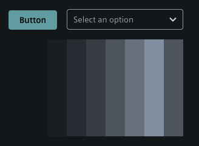
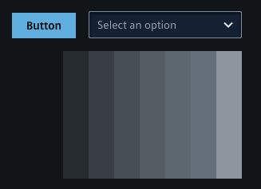
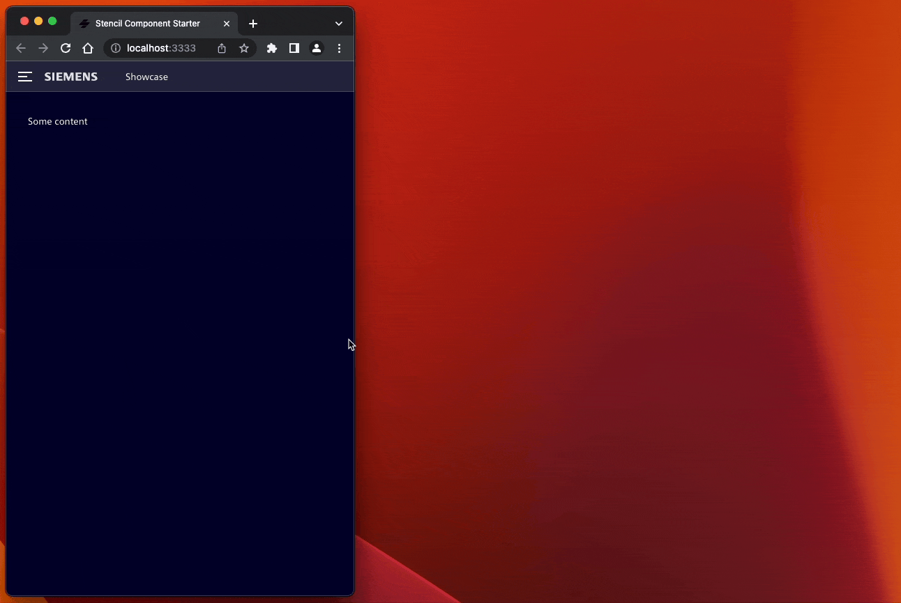
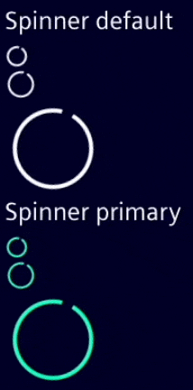

# Updating to v2.0.0

Welcome to the migration guide for upgrading from Siemens iX v1 to v2.
Please follow this guide to ensure a smooth and successful migration process.

## Checkout the breaking changes in detail

Checkout the [Breaking Changes guide](https://github.com/siemens/ix/blob/main/BREAKING_CHANGES.md#v200).

# New default theme

We replaced the old theme with a more modern looking theme.

__Old:__



__New:__




# New concepts

## Replace Bootstrap Modal parts with iX modal components

```html
  <ix-modal-header>My Header</ix-modal-header>
  <ix-modal-content>My Content</ix-modal-content>
  <ix-modal-footer>
    <ix-button>Save</ix-button>
    <ix-button>Cancel</ix-button>
  </ix-modal-footer>
```

## ix-basic-navigation and ix-menu

In the latest version of `ix-basic-navigation`, we have changed how menu items overflowing outside the menu container are being handled. Previously, when there were too many items, users had to click on a dropdown to see the hidden ones, resulting in a suboptimal experience.
Now the list of menu items will scroll vertically to prevent overflow.
This ensures that all menu items remain contained within the menu, offering a more intuitive and visually consistent experience.

### New component `ix-menu-category`

`ix-menu-category` is a new addition to the `ix-menu` that enables the creation of second-level navigation within the `ix-menu` component. With `ix-menu-category`, you can organize your menu items into categories, providing a hierarchical structure for your menu navigation.

```tsx
<ix-menu-category label="AI Configuration" icon="rocket">
  <ix-menu-item>Nested Item 1</ix-menu-item>
  <ix-menu-item>Nested Item 2</ix-menu-item>
</ix-menu-category>
```

### Multiple screen layouts within the `ix-basic-navigation`

The `ix-basic-navigation` introduces new layout breakpoints that affect the display and behavior of the menu component based on the screen size. These breakpoints provide a responsive and adaptive menu layout for different devices and screen resolutions.



With the updated version of ix-menu, you have the flexibility to choose which layout breakpoints are supported. You can specify the supported modes using the `breakpoints` property. This allows you to customize the menu's behavior and appearance according to your specific requirements.

The following breakpoints are now available in ix-menu:

- **sm**: `only screen and (min-width: 36em)`
  - Menu not visible.
- **md**: `only screen and (min-width: 48em)`
  - Menu visible but requires expansion to see the complete menu.
- **lg**: `only screen and (min-width: 62em)`
  - Shows the menu as pinned in full width.
  - The overlaying content is moved to the left.

These breakpoints enable the menu to adapt its layout and behavior according to the available screen space, ensuring optimal visibility and usability for different screen sizes.

By setting the `breakpoints` property, you can define which layout modes should be enabled for your menu. For example, if you want to support only the small and medium breakpoints, you can set the `breakpoints` property as follows:

```tsx
<ix-basic-navigation breakpoints={['sm', 'lg']}>
  <ix-menu>
    <!-- Menu items and categories -->
  </ix-menu>
</ix-basic-navigation>
```

## Spinner animation

We replaced the previous animation with a cleaner and more refined alternative.



## Shadow DOM

We are excited to announce that we have migrated all of our components to Shadow DOM. This migration brings several benefits and enhancements to the functionality and performance of our library.

Here are the key advantages of migrating to Shadow DOM components:

1. **Interoperable**: Shadow DOM provides encapsulation for components, isolating their styles and markup within a dedicated DOM subtree. This ensures predictable and maintainable styling, while enabling seamless integration of self-contained and reusable components into various projects without conflicts or interference with existing styles and functionality.

2. **Improved Performance**: Shadow DOM components have better performance due to the browser's optimized rendering of the encapsulated DOM subtree. This results in faster initial rendering and improved overall responsiveness of the components.

Please note that as part of this migration, some changes may be required in your codebase if you were relying on direct manipulation or styling of our components. We recommend reviewing our updated documentation and examples to ensure a smooth transition and take full advantage of the benefits offered by Shadow DOM components.

## Preparation of removing bootstrap as dependency

As part of the [Shadow DOM](#shadow-dom) refactoring all components are interoperable. Which means that we are no longer depends on any css framework. This give us the opportunity to divide us from bootstrap. Which does not mean that bootstrap is bad or lesser good the alternatives like Tailwind. We want to give the application developer the chance to chooser there css framework by there own without having conflicts.

As for now bootstrap is still a part of our library but in future releases we planning to drop bootstrap entirely.

If you want to check if your application are still working smoothness without bootstrap you can already test this by loading the new `core css` file without any dependency to bootstrap anymore.

A detailed description can be found [here](./../../guidelines/theme#applying-only-one-theme-to-reduce-build-size).

# Questions ❓🙋‍♀️

Don't forget to checkout the [Breaking Changes guide](https://github.com/siemens/ix/blob/main/BREAKING_CHANGES.md).

If you have question or facing problems during migration [contact us over our forum](https://community.siemens.com/c/ix/)
